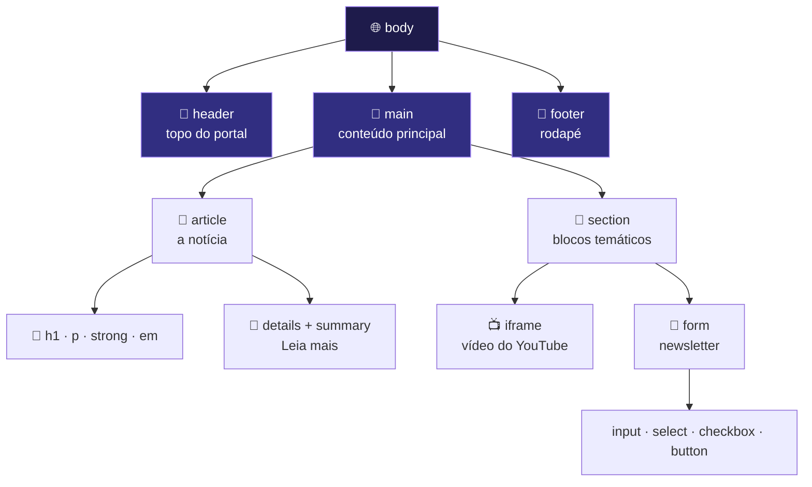
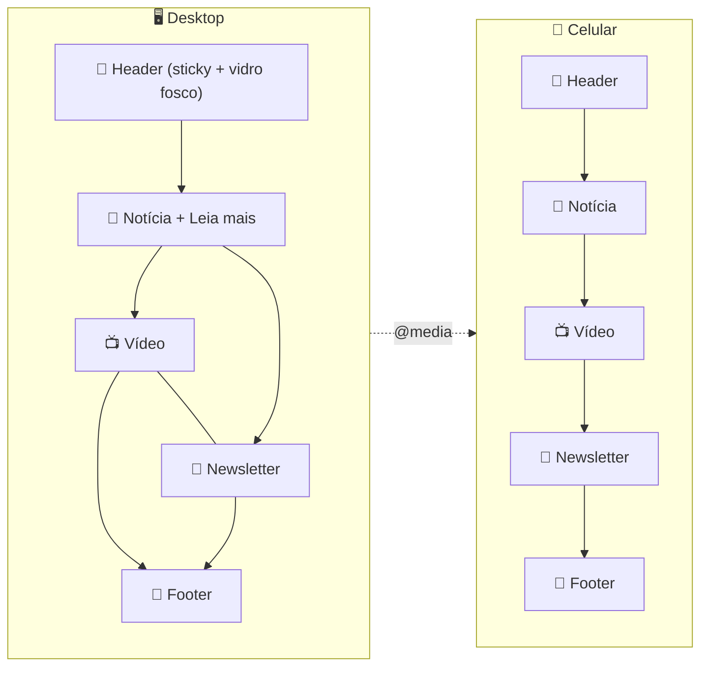
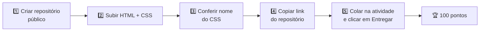

<div align="center">


<a href="https://github.com/SEU-USUARIO/technews-today">
  
</a>

<br/>


<br/>

**[🌐 Ver demo](#-demo-ao-vivo) · [🎯 Desafio](#-o-desafio) · [🧩 Anatomia](#-anatomia-do-html) · [🎨 Técnicas de CSS](#-técnicas-de-css-usadas) · [🚀 Como rodar](#-como-executar) · [🙋 Autor](#-autor)**

</div>

---

## 📑 Sumário

<details open>
<summary><b>Clique para recolher/expandir o índice</b></summary>

1. [📖 Sobre o projeto](#-sobre-o-projeto)
2. [📸 Preview](#-preview)
3. [🌐 Demo ao vivo](#-demo-ao-vivo)
4. [🎯 O desafio](#-o-desafio)
5. [✅ Checklist de requisitos](#-checklist-de-requisitos)
6. [🛠️ Tecnologias](#️-tecnologias)
7. [🗂️ Estrutura do repositório](#️-estrutura-do-repositório)
8. [🧩 Anatomia do HTML](#-anatomia-do-html)
9. [🎨 Técnicas de CSS usadas](#-técnicas-de-css-usadas)
10. [📱 Layout responsivo](#-layout-responsivo)
11. [🌈 Paleta de cores](#-paleta-de-cores)
12. [🚀 Como executar](#-como-executar)
13. [📤 Como foi a entrega](#-como-foi-a-entrega)
14. [🧠 O que aprendi](#-o-que-aprendi)
15. [❓ Perguntas frequentes](#-perguntas-frequentes)
16. [🔮 Próximos passos](#-próximos-passos)
17. [🙋 Autor](#-autor)

</details>

---

## 📖 Sobre o projeto

O **TechNews Today** nasceu na **Aula 10** do curso de **Desenvolvimento de Sistemas (SENAI)**. Na aula, um portal de notícias de tecnologia foi **desmontado peça por peça** para entender o que cada tag HTML realmente faz. O desafio da semana foi pegar essa página "crua" e transformá-la em um **portal moderno e escuro**, usando **somente CSS**.

> 💡 **Ideia central:** o HTML já vem pronto e **não pode ser alterado**. Todo o visual vem de **um único arquivo CSS**, com no máximo **50 linhas**.

### ✨ Destaques

| | Recurso | Como foi feito |
|---|---|---|
| 🪟 | Header de vidro fosco | `backdrop-filter: blur()` + fundo translúcido |
| 🌈 | Título em degradê | `linear-gradient` + `background-clip: text` |
| 🧱 | Layout em grade | `display: grid` |
| 📌 | Cabeçalho que acompanha a rolagem | `position: sticky` |
| 📺 | Vídeo e newsletter lado a lado | CSS Grid com colunas |
| 📱 | Adaptação para celular | `@media (max-width: …)` |
| 📖 | "Leia mais" sem JavaScript | `<details>` + `<summary>` nativos |

---

## 📸 Preview

<!--
  📌 DICA: depois de subir os prints para a pasta /assets, remova este comentário
  e ajuste os nomes dos arquivos abaixo.

<div align="center">

| 🖥️ Desktop | 📱 Celular |
|:---:|:---:|
|  |  |

</div>
-->

> 🖼️ *Os prints do projeto podem ser adicionados na pasta `assets/` e exibidos aqui.*

---

## 🌐 Demo ao vivo

Acesse o projeto publicado pelo **GitHub Pages**:

### 👉 [`https://SEU-USUARIO.github.io/technews-today/desafio10a.html`](https://SEU-USUARIO.github.io/technews-today/desafio10a.html)

<details>
<summary><b>⚙️ Como ativar o GitHub Pages neste repositório</b></summary>

1. Abra o repositório no GitHub e vá em **Settings** ⚙️
2. No menu lateral, clique em **Pages**
3. Em **Build and deployment**, escolha **Deploy from a branch**
4. Selecione a branch **`main`** e a pasta **`/ (root)`**
5. Clique em **Save** e aguarde cerca de 1 a 2 minutos ⏳
6. O link do site aparece no topo da página de Pages 🎉

> ⚠️ Como o arquivo principal se chama `desafio10a.html` (e não `index.html`), lembre de colocar o nome dele no final do link.

</details>

---

## 🎯 O desafio

> **📱🚀 Aula 10 — TechNews Today!** · Prof. **André Luis Denani** · **100 pontos**

Criar o arquivo **`10a_desafio.css`** e transformar a página `desafio10a.html` em um **portal moderno e escuro**, seguindo os prints de referência:

- 🪟 **Header** de vidro fosco
- 🌈 **Título** com degradê
- 📺 **Vídeo** e 📧 **newsletter** lado a lado
- 🌙 Visual escuro e moderno de ponta a ponta

---

## ✅ Checklist de requisitos

<details open>
<summary><b>📋 Requisitos técnicos do desafio</b></summary>

- [x] 🪟 **Glassmorphism** com `backdrop-filter`
- [x] 🌈 **Gradiente no texto**
- [x] 🧱 **CSS Grid** no layout
- [x] 📌 **Header** com `position: sticky`
- [x] 📱 **Media query** para celular
- [x] 📏 **No máximo 50 linhas** de CSS
- [x] 🚫 **Sem frameworks**
- [x] 🚫 **Sem JavaScript**
- [x] 🚫 **Sem mexer no HTML**

</details>

<details>
<summary><b>🏆 Boas práticas extras (capricho!)</b></summary>

- [x] 💬 Comentários nas partes importantes do CSS
- [x] 🔗 Nome do CSS idêntico ao do `<link>` no HTML
- [x] 📂 Repositório **público** no GitHub
- [x] 📝 README completo e organizado

</details>

---

## 🛠️ Tecnologias

<div align="center">


</div>

---

## 🗂️ Estrutura do repositório

```text
📦 technews-today
 ┣ 📜 desafio10a.html     ← página completa (fornecida na aula, intocada)
 ┣ 🎨 10a_desafio.css     ← todo o visual do portal (máx. 50 linhas)
 ┗ 📖 README.md           ← você está aqui
```

> 🔗 O HTML carrega o estilo pelo `<link rel="stylesheet" href="10a_desafio.css">`. Se o nome do arquivo estiver diferente, **o estilo simplesmente não carrega**. 😱

---

## 🧩 Anatomia do HTML

O ponto de partida da aula: um **esqueleto semântico**, onde cada tag tem um papel claro.



<details>
<summary><b>🧱 Tags de estrutura (o esqueleto semântico)</b></summary>

| Tag | Função | Por que usar em vez de `<div>`? |
|---|---|---|
| `<header>` | Cabeçalho da página ou da seção | Indica o topo e a navegação |
| `<main>` | Conteúdo principal, único por página | Ajuda leitores de tela a pular direto ao essencial |
| `<article>` | Conteúdo independente (uma notícia) | Faz sentido sozinho, até fora da página |
| `<section>` | Agrupamento temático | Organiza o conteúdo em blocos com assunto |
| `<footer>` | Rodapé | Créditos, contatos e informações finais |

</details>

<details>
<summary><b>📝 Tags de texto</b></summary>

| Tag | Função |
|---|---|
| `<h1>` | Título principal da página |
| `<p>` | Parágrafo |
| `<strong>` | Destaque de **forte importância** |
| `<em>` | Ênfase, com sentido de *entonação* |

</details>

<details>
<summary><b>📖 "Leia mais" sem JavaScript 🤯</b></summary>

As tags `<details>` e `<summary>` criam um **bloco que abre e fecha sozinho**, sem nenhuma linha de JavaScript. O `<summary>` é o que fica sempre visível, e o resto do conteúdo aparece ao clicar.

```html
<details>
  <summary>Leia mais</summary>
  <p>Este texto só aparece depois do clique!</p>
</details>
```

> 👀 Você está vendo essa mesma técnica agora: os blocos recolhíveis deste README usam `<details>`!

</details>

<details>
<summary><b>📺 Vídeo do YouTube com <code>iframe</code></b></summary>

O `<iframe>` incorpora outra página dentro da sua. É assim que o vídeo do YouTube aparece **dentro** do portal, sem sair do site.

</details>

<details>
<summary><b>📧 Formulário de newsletter</b></summary>

| Elemento | Para que serve |
|---|---|
| `<input>` | Campo de digitação (nome, e-mail…) |
| `<select>` | Lista de opções para escolher |
| `<input type="checkbox">` | Caixa de marcar (aceite, preferência…) |
| `<button>` | Botão de enviar |

😎 **Bônus:** com o atributo `required`, o próprio navegador avisa *"Preencha este campo."* sozinho, sem JavaScript.

</details>

---

## 🎨 Técnicas de CSS usadas

> 📌 Os trechos abaixo são **exemplos didáticos de cada técnica**, para estudo. O código completo do projeto está em [`10a_desafio.css`](./10a_desafio.css).

<details>
<summary><b>🪟 1. Glassmorphism (vidro fosco)</b></summary>

Efeito de vidro: um **fundo translúcido** combinado com **desfoque** do que está atrás do elemento.

```css
header {
  background: rgba(255, 255, 255, 0.08);   /* fundo semitransparente */
  backdrop-filter: blur(12px);             /* desfoca o que está atrás */
  border: 1px solid rgba(255, 255, 255, 0.15);
}
```

💡 Sem transparência no fundo, o desfoque não aparece. Os dois trabalham juntos.

</details>

<details>
<summary><b>🌈 2. Gradiente no texto</b></summary>

O degradê é aplicado como **fundo** e depois **recortado no formato das letras**.

```css
h1 {
  background: linear-gradient(90deg, #38bdf8, #a78bfa, #f472b6);
  -webkit-background-clip: text;
  background-clip: text;
  -webkit-text-fill-color: transparent;    /* deixa o texto "vazado" */
}
```

</details>

<details>
<summary><b>🧱 3. CSS Grid</b></summary>

Cria **linhas e colunas** de forma simples. Ideal para colocar o vídeo e a newsletter **lado a lado**.

```css
.duas-colunas {
  display: grid;
  grid-template-columns: 1fr 1fr;          /* duas colunas iguais */
  gap: 24px;                               /* espaço entre elas */
}
```

</details>

<details>
<summary><b>📌 4. Header sticky</b></summary>

O cabeçalho **fica preso no topo** enquanto a página rola.

```css
header {
  position: sticky;
  top: 0;
  z-index: 10;                             /* fica acima do conteúdo */
}
```

</details>

<details>
<summary><b>📱 5. Media query (celular)</b></summary>

Muda o layout quando a tela é pequena. No celular, as duas colunas viram **uma só**.

```css
@media (max-width: 768px) {
  .duas-colunas {
    grid-template-columns: 1fr;            /* uma coluna só */
  }
}
```

</details>

<details>
<summary><b>🏁 Resumo das técnicas</b></summary>

| Técnica | Propriedade-chave | Efeito |
|---|---|---|
| Glassmorphism | `backdrop-filter` | Vidro fosco |
| Texto em degradê | `background-clip: text` | Título colorido |
| Layout em grade | `display: grid` | Colunas organizadas |
| Header fixo | `position: sticky` | Topo acompanha a rolagem |
| Responsividade | `@media` | Adapta ao celular |

</details>

---

## 📱 Layout responsivo



| Elemento | 🖥️ Desktop | 📱 Celular |
|---|---|---|
| Vídeo + Newsletter | Lado a lado | Um embaixo do outro |
| Header | Sticky | Sticky |
| Colunas do grid | 2 | 1 |

---

## 🌈 Paleta de cores

> 🎨 Paleta de referência do tema escuro. Ajuste os valores para os que realmente estão no seu CSS.

| Cor | Hex | Uso sugerido |
|:---:|:---:|---|
|  | `#0B0F1A` | Fundo da página |
|  | `#1E1B4B` | Cartões e blocos |
|  | `#38BDF8` | Início do degradê |
|  | `#A78BFA` | Destaques |
|  | `#F472B6` | Fim do degradê |
|  | `#E5E7EB` | Texto principal |

---

## 🚀 Como executar

<details open>
<summary><b>💻 Opção 1 — Clonar e abrir</b></summary>

```bash
# 1. Clone o repositório
git clone https://github.com/SEU-USUARIO/technews-today.git

# 2. Entre na pasta
cd technews-today

# 3. Abra o arquivo no navegador
#    (dê dois cliques em desafio10a.html)
```

</details>

<details>
<summary><b>⚡ Opção 2 — VS Code + Live Server</b></summary>

1. Abra a pasta do projeto no **VS Code**
2. Instale a extensão **Live Server**
3. Clique com o botão direito em `desafio10a.html`
4. Escolha **Open with Live Server**
5. A página recarrega sozinha a cada alteração no CSS 🔄

</details>

<details>
<summary><b>📥 Opção 3 — Baixar o ZIP</b></summary>

1. Clique no botão verde **Code** deste repositório
2. Escolha **Download ZIP**
3. Extraia os arquivos **na mesma pasta** (HTML e CSS juntos!)
4. Abra `desafio10a.html` no navegador

</details>

> ⚠️ **Importante:** os arquivos `desafio10a.html` e `10a_desafio.css` precisam estar **na mesma pasta**, senão o estilo não carrega.

---

## 📤 Como foi a entrega



<details>
<summary><b>📋 Checklist antes de entregar</b></summary>

- [x] Repositório está **público**
- [x] `desafio10a.html` foi enviado
- [x] `10a_desafio.css` foi enviado
- [x] O nome do CSS é **idêntico** ao do `<link>` no HTML
- [x] O CSS tem **no máximo 50 linhas**
- [x] O link do repositório foi colado na atividade
- [x] Cliquei em **Entregar** ✅

> 🚨 Só vale o **link do repositório**. Arquivo solto ou print não conta como entrega.

</details>

---

## 🧠 O que aprendi

<details>
<summary><b>🔍 Sobre HTML</b></summary>

- Tags semânticas dão **significado** à página, não só aparência
- `<details>` e `<summary>` fazem um acordeão **sem JavaScript**
- Um `<iframe>` permite incorporar um vídeo do YouTube
- Formulários têm validação nativa do navegador

</details>

<details>
<summary><b>🎨 Sobre CSS</b></summary>

- Dá para criar um visual completo com **poucas linhas** bem pensadas
- `backdrop-filter` só funciona bem com fundo **semitransparente**
- `background-clip: text` transforma o degradê em cor do texto
- CSS Grid simplifica layouts em colunas
- Media queries tornam o site amigável para o celular

</details>

<details>
<summary><b>🐙 Sobre Git e GitHub</b></summary>

- Criar e organizar um repositório público
- Entregar um trabalho por link de repositório
- Documentar um projeto com um bom README

</details>

---

## ❓ Perguntas frequentes

<details>
<summary><b>😱 Abri o HTML e o estilo não carregou. O que houve?</b></summary>

Verifique estes três pontos:

1. O nome do CSS é **exatamente** `10a_desafio.css` (maiúsculas, minúsculas e underline importam)
2. O HTML e o CSS estão **na mesma pasta**
3. O `<link>` dentro do HTML aponta para esse mesmo nome

</details>

<details>
<summary><b>🪟 O efeito de vidro fosco não aparece. E agora?</b></summary>

- Confira se o fundo do header é **semitransparente** (`rgba`)
- Use também o prefixo `-webkit-backdrop-filter` para maior compatibilidade
- Confirme que existe algo **atrás** do header para ser desfocado

</details>

<details>
<summary><b>🚫 Por que não posso usar JavaScript ou frameworks?</b></summary>

O objetivo é **treinar CSS puro** e entender o que o navegador já faz sozinho. O "Leia mais" e a validação do formulário são exemplos de recursos nativos do HTML.

</details>

<details>
<summary><b>📏 Por que o limite de 50 linhas?</b></summary>

Para incentivar um CSS **enxuto e inteligente**: usar seletores certos, agrupar regras e aproveitar bem Grid e propriedades modernas.

</details>

---

## 🔮 Próximos passos

- [ ] 🖼️ Adicionar os prints do projeto na pasta `assets/`
- [ ] 🌗 Experimentar um **tema claro** com `prefers-color-scheme`
- [ ] 🎞️ Testar `transition` em botões e links
- [ ] 🔤 Explorar fontes do Google Fonts
- [ ] ♿ Revisar acessibilidade (contraste e foco do teclado)
- [ ] 🧪 Validar o HTML e o CSS nos validadores da W3C

---

## 🙋 Autor

<div align="center">

### **Vinycius Lopes Monteiro da Silva**
🎓 Estudante de **Desenvolvimento de Sistemas** · **SENAI** · Turma **1ID-DS**

[](https://github.com/SEU-USUARIO)
[](https://www.linkedin.com/in/SEU-PERFIL)

</div>

### 🙏 Agradecimentos

- 👨‍🏫 Ao professor **André Luis Denani**, pela aula e pelo desafio
- 🏫 Ao **SENAI**, pelo ambiente de aprendizado
- 🤝 À turma **1ID-DS**, pela troca de ideias

---

<div align="center">

⭐ **Gostou do projeto? Deixe uma estrela no repositório!** ⭐

*Projeto educacional desenvolvido na Aula 10 · Desafio CSS TechNews Today*


</div>
